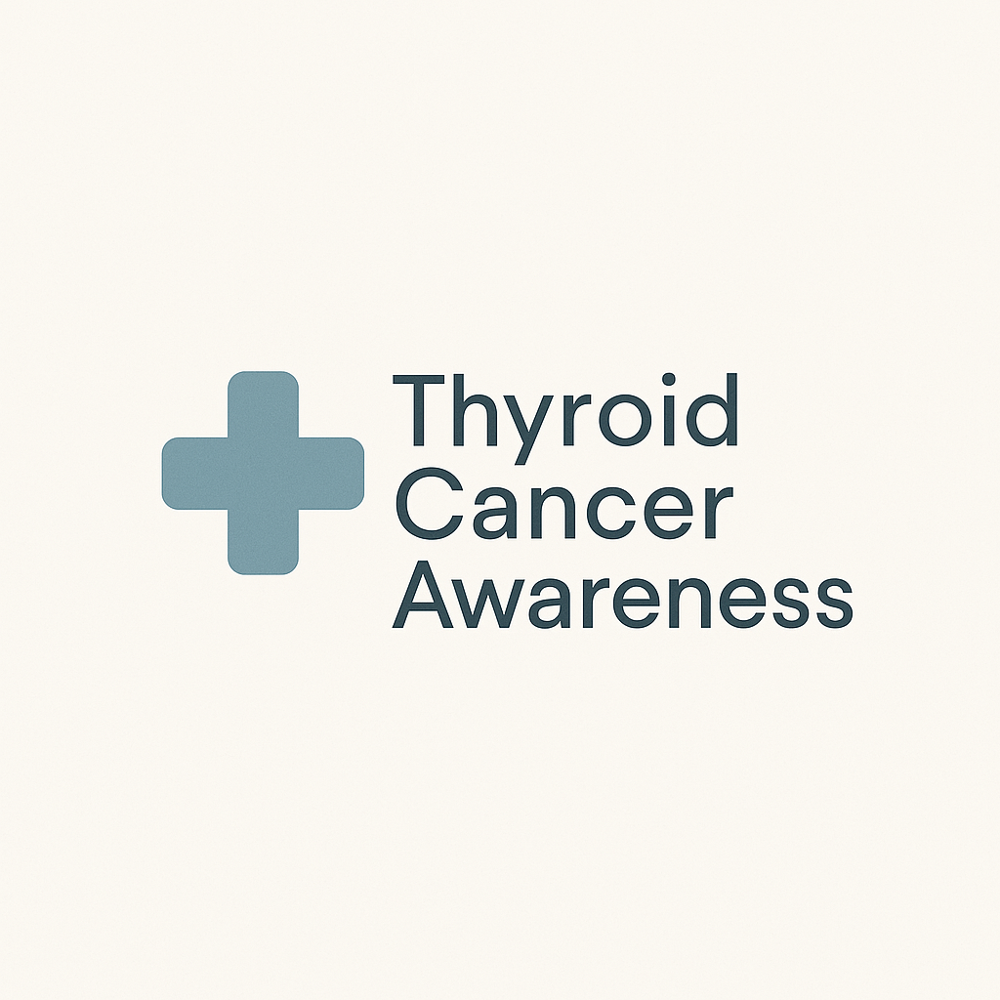

# 🩺 Cancer Prediction

A web-based application designed to predict the likelihood of cancer based on user-provided medical inputs. The goal of this project is to provide an educational tool that demonstrates the use of machine learning in healthcare, focusing on early cancer detection.



## 🚀 Project Overview

This project utilizes a trained machine learning model to predict the probability of cancer using various health-related parameters. It features:
- User-friendly web interface built with **React** and **Vite**
- Backend prediction powered by a trained ML model
- Informative dashboards and charts using **Tableau**
- Real-time news updates on thyroid cancer
- Firebase integration for testimonials and newsletter subscriptions

> **Note:** This is an educational project, not intended for clinical use.

## 🧩 Features

- ✅ Clean and responsive web interface
- ✅ Thyroid cancer-specific information and predictions
- ✅ Dashboard with summary cards, charts, and data tables
- ✅ News section for the latest updates on thyroid cancer
- ✅ Testimonial submission and newsletter signup (via Firebase)
- ✅ AI-powered chatbot for medically accurate responses (coming soon)

## 🛠️ Tech Stack

- **Frontend:** React.js, Vite, shadcn/ui, Tailwind CSS
- **Backend:** Python, Scikit-learn
- **Deployment:** Firebase
- **Data Visualization:** Tableau (external links)
- **APIs:** NewsAPI
- **ML Model:** Trained using thyroid cancer dataset
- **Others:** AllenAI Science Summarizer for professional chatbot responses

## 📂 Folder Structure

```
/public          -> Static files (logo, favicon)
/src
  /components    -> Reusable UI components
  /pages         -> Main application pages
  /services      -> Firebase and API services
  /assets        -> Images and assets
  App.jsx        -> Main app component
  main.jsx       -> Entry point
```

## 🧑‍💻 Getting Started

### Prerequisites
- Node.js (v16+ recommended)
- npm or yarn
- Python 3.8+
- Firebase project (for newsletter & testimonials)

### Installation

1. **Clone the repository**
   ```bash
   git clone https://github.com/Shinkhal/Cancer-Prediction.git
   cd Cancer-Prediction
   ```

2. **Install dependencies**
   ```bash
   npm install
   ```

3. **Configure environment variables**

   Create a `.env` file in the root directory:
   ```
   Add all the APIs 
   ```

4. **Run the app locally**
   ```bash
   npm run dev
   ```

5. **Backend Model (Optional)**  
   Make sure your ML model is served via an API endpoint if running separately.


## 📊 Dataset

The dataset used in this project focuses on **Thyroid Cancer** detection and analysis.
- You can explore it in the Dashboard section.
- External dashboard links are provided for an in-depth view.

## 🤝 Contributions

Contributions are welcome!  
Feel free to fork this repo and submit pull requests.

1. Fork the repository
2. Create your feature branch (`git checkout -b feature/YourFeature`)
3. Commit your changes (`git commit -m 'Add some feature'`)
4. Push to the branch (`git push origin feature/YourFeature`)
5. Open a Pull Request

## ⚠️ Disclaimer

This tool is intended for **educational purposes only** and is **not** a substitute for professional medical advice, diagnosis, or treatment.

## 📬 Contact

For any questions or suggestions:
- GitHub Issues
- [LinkedIn](https://www.linkedin.com/in/shinkhal-sinha/) (Add your profile here!)

---

### ⭐️ If you found this project useful, give it a star!
